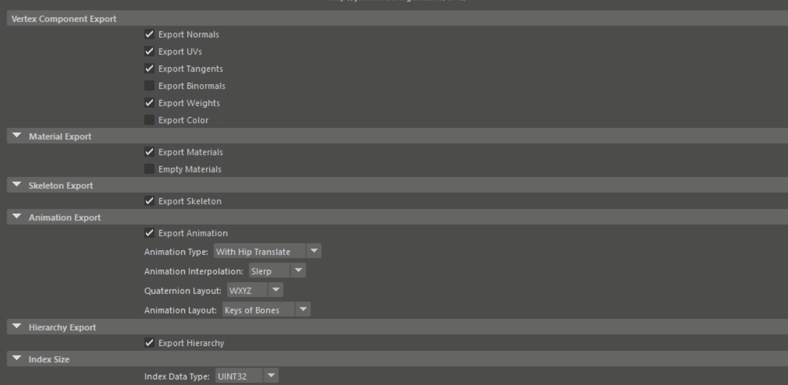
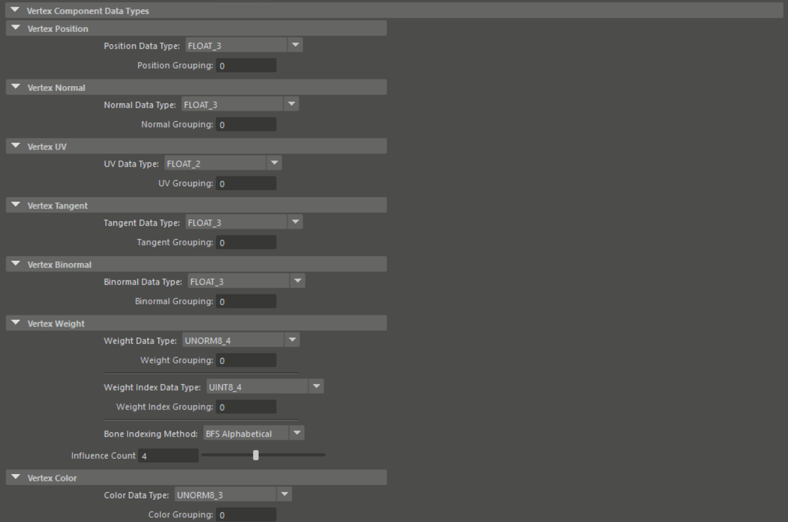
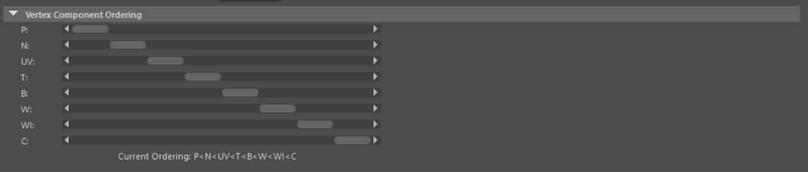

# GPU Friendly Graphics (GFG)
GPU Friendly Graphics (GFG) file format designed for fast mesh data streaming for simple use-cases such as prototyping and research. This format is designed to dump a model to the GPU as fast as possible. It is specifically designed for GPU APIs which more or less . GFG File Format support rendering related meshes, materials, skeletons (joint hierarchies) and animation (joint rotations as quaternions).

It is designed to have minimal data management between your favorite Computer Graphics Modelling Software (Only Autodesk Maya at the moment)
and the GPU Memory. It can literally take one memcopy (per-mesh) to put your vertex data to GPU memory (two if your mesh is indexed).

### GFG Pros

- Single Indexed Mesh
- Supports sub-mesh materials (face materials)
- Supports transform hierarchy (parent child meshes, transform nodes etc.)
- Supports Basic Animation
- Supports Materials
- GPU applicable data layout
- User defined data layouts
- Packing Vertex Components
- Variable Index Sizes (8, 16, 32 bits)
- Binary Format

### GFG Cons

- Does not support pivot, pivot position
- Material is only defined to import back to modelling software if necessary. It is nowhere near robust since, it favours bandwidth over quality (if you use packed data)
- No naming support (Objects have unique ids (indices) instead of names)
- Very simple animation, Animation only holds bone (joint) rotations and hip(root) translation key frames.
- Lossy data when importing back to the modelling software if data type you choose lossy.

## Building

There are two build systems in the repository, Visual Studio Solution and CMake. Visual Studio can be considered as obsolete, CMake should be used instead. There is only three CMake variables for configuration.

 - `GFG_INSTALL` enables installation
 - `GFG_BUILD_MAYA_PLUG_IN` enables building the maya plug-in
 - `GFG_MAYA_INSTALL_DIRECTORY` variable is only useful when building maya plugin. This will be used to include/link maya related libraries/headers.

Just call CMake with your favorite compiler and it should work. (Tested with recent versions of Visual Studio and clang)

## Simple Documentation

Disclaimer: This documentation is not complete. I've written this format years ago, and I may change in the future. Overall it is somewhat a simple format which may give some idea to other people how to manage mesh data for Computer Graphics purposes for simple use-cases.

### Format Definition

GFG file as overall has a similar layout like ".dds" files (but stores meshes). It has a header portion and data portion. Unlike ".dds" format, header is variable sized and can hold multiple meshes with different data layouts according to your needs.

Format layout can be inferred from the [GFGHeader.h][4] file `GFGHeader` class (with little bit of work):

- First four bytes are a four character code (fourCC). It should be " GFG".
- Next 8 bytes is a 64-bit unsigned integer that hold the size of the entire header in bytes.
- Next 8 bytes is another 64-bit unsigned integer that is shows the offset of the transform sub-header.
- After that there are 4 jump lists; which are defined by single 32-bit integer `n` and `n` 64-bit integer(s). These are are the direct offsets of each data component **sub-header** in the header. In order there are four jump tables:
    - Meshe(s)
    - Material(s)
    - Skeleton(s)
    - Animation(s)
- Header definition continues with the scene node hierarchy. It is represented as flattened tree with only parent pointers, index of the transform and the mesh/material pairing index.
- Next segment is material mesh pairing list, which defines which contiguous sub portion of a mesh corresponds to a material.
- Similar to the segment above, the next segment pairs the skeleton data with the a mesh.
- List of Mesh, Material, Skeleton, and Animation sub-headers are next on the header.
- Finally, there are two list of transforms at the end of the header.

#### Mesh Sub-Headers

Each mesh sub-header are variable sized. It consists of a common part (`GFGHeaderCore`) and vertex component part.

```cpp
struct GFGMeshHeaderCore
{
	// Size Values
	uint64_t	vertexCount;	// # of vertices
	uint64_t	indexCount;		// # of indices
	uint32_t	indexSize;		// individual Index Size (in bytes)

	// Topology
	GFGTopology topology;       // TRIANGLE, TRIANGLE_STRIP, LINE or POINT

	uint64_t	vertexStart;	// Starting Location of Vertex Data
                                // (byte offset relative to Data Start)
	uint64_t	indexStart;		// Starting Location of Index Data
                                // (byte offset relative to Data Start)
	GFGAABB		aabb;			// Axis Aligned bounding box (object space)

	// Components
	uint32_t			componentCount;	// # of components
};

// Components of this mesh (n)
struct GFGVertexComponent
{
	GFGDataType	            dataType;		// Type of the data
                                            // (FLOAT_3, FLOAT_2 etc.)
											// Size of this data type (in bytes) can
                                            // be fetched using dataType
	GFGVertexComponentLogic logic;			// Component Logic
                                            // (POSITION, NORMAL UV etc.)
	uint64_t				startOffset;	// Start location of this data structure
                                            // relative to vertexStart (in bytes)
	uint64_t				internalOffset;	// Start location of this data
                                            // relative to startOffset (in bytes)
	uint64_t				stride;			// Stride of this data structure (in bytes)
};
```

For convenience, GFG mandates storing an Axis-Aligned Bounding Box (AABB) of each mesh.

With this definition, you can define mix and match between Array of Structs (AoS) or Struct of Arrays(SoA) for each individual mesh components. If `startOffset` of a group vertex components match that means these are in a logical struct (with a stride of `stride`).

This layout tries to correspond with the primitive assembly of the rasterizer graphics pipeline. You can morph these definitions directly to your favorite graphics API and directly use it with minimal effort (hence the name "GPU Friendly Graphics").


#### Material Sub-Headers

Material portion of the data format is not well thought out, and it stores series of textures (spatially varying data) / uniforms (constant data) and an enumeration that represents the utilization of such data. Currently enum `EMPTY` should be used.

#### Skeleton Sub-Headers

Bone sub-headers are simple hierarchy similar to the scene hierarchy of the entire file. Each skeleton has a hierarchy of bones. Each bone holds a transform and a parent index similar to the scene hierarchy.

#### Transforms

Each scene node or bone refers a transform structure. Transforms are stored as Transform Rotate Scale (TRS) triplets. Each triplet holds three 32-bit floating point number that represents translation amount (XYZ) euler angles (rotation order X, Y, and then Z) and scale (again XYZ). Transformation order is to scale then rotate and finally translation.

#### Why inverted hierarchies?

Both bone and scene hierarchies holds inverted n-ary trees (each node holds its parent instead of its children). Since each node has variable amount of children we need to dynamically parse each node to flatten the transforms for rendering. We could've hold directly flattened data but then we would lost of opportunity to refeed this data back to a modelling software.

With this approach we can get away with single struct (data and the parent index) for all complex trees. For actual flattening the data, one can traverse the parent index chain and multiply the transforms in an inverse fashion (this can even be trivially parallelized). This is not optimal in terms of process (it takes O(nlogn) instead of O(n), given the tree is relatively balanced) but it is simple to store.

### Maya Import/Export Definition

GFG Comes with a Autodesk Maya Exporter, and Importer (importer is relatively incomplete) extension. After the CMake install step rename "GFGMaya.dll" (or .so) to "GFGMaya.mll" and copy it and all the ".mel" files to a location which Maya can access. Load the extension and export/import functionality should be available on the appropriate dialogs.

GUI of the File Export portion of the extension is given below:





"Export XX" flags are self-explanatory, enables disable certain vertex components. So called "animation" represents series of bone rotations of a particular skeleton.

To represent the layout of the exported meshes, user can select an appropriate data type and the grouping. Each component with the the same group number will be on the same struct. Relative ordering of data within struct can be adjusted with the sliders in section "VertexComponentOrdering".

## Usage

```cpp
GFGFileReaderSTL reader("test.gfg");
GFGFileLoader gfgFile(&reader);

GFGFileError e = gfgFile.ValidateAndOpen();
// Check error e...

const GFGHeader& header = gfgFile.Header();
// You can access entire contents of the header after "ValidateAndOpen"
// For the actual data, you need to query...
size_t meshSize = 0;  // ... set the actual size from the header
size_t indexSize = 0; // ... similarly find the size from the header

// Load all of the mesh vertex data
size_t meshIndex = 0; // First mesh of the file
std::vector<uint8_t> dataVector(meshSize, 0);
gfgFile.MeshVertexData(dataVector.data(), meshIndex);

std::vector<uint8_t> indexVector(indexSize, 0);
gfgFile.MeshIndexData(indexVector.data(), meshIndex);

// Load only a specific struct of a mesh
// If struct consists of multiple components
// calling with any of those components will give the same data
using enum GFGVertexComponentLogic;
size_t subSize = gfgFile.MeshVertexComponentDataGroupSize(meshIndex, POSITION);
std::vector<uint8_t> subData(subSize, 0);
gfgFile.MeshVertexComponentDataGroup(subData.data(), meshIndex, POSITION);

// Then memcpy this data to GPU memory and set the
// primitive assembly of the graphics pipeline accordingly ...

// Animations, materials have the similar interfaces, please check "GFGFileLoader.h"

```

## TODO List:

- Generate `glMultiDrawElementsIndirect` buffer for the entire file (not only for openGL but DX and Vulkan as well). So that user can dump the mesh buffer and the generated indirect draw call buffer directly to the GPU and draw without hassle.
- Modernize the API (uint8_t c arrays to std::span, which is safer as well)
- Add Vertex Morph Target Animation Support
- UE5 Importer
- Porting to Linux (to GCC/clang), and Linux Version of Maya
- GFG File viewer GUI program
- None of the data types tested properly (only tested FLOAT_3 data type). Some of the data types are probably obsolete.
- Make Implementation of the new data types simple and easy, so that people pull request their new data format
- Above statement also goes for the new material types.
- Blender Importer/Exporter
- Autodesk 3DMax Importer/Exporter
- Autodesk 3DMax, Blender Materials (as basic as Maya)

## Dependencies

"Half" Library for half precision IEEE754 floating point format. Provided in the source. For more information and license click [here][3]

Maya Importer/Exporter also relies on the Maya extension API.

## License

GFG File format related code is released under the MIT License. See [LICENSE][1] for details.

Half Library is under MIT License. See [Half License][2] for details.

[1]: https://github.com/yalcinerbora/GFGFileFormat/blob/master/LICENSE
[2]: http://half.sourceforge.net/LICENSE.txt
[3]: http://half.sourceforge.net/
[4]: https://github.com/yalcinerbora/GFGFileFormat/blob/master/Source/GFG/GFGHeader.h
